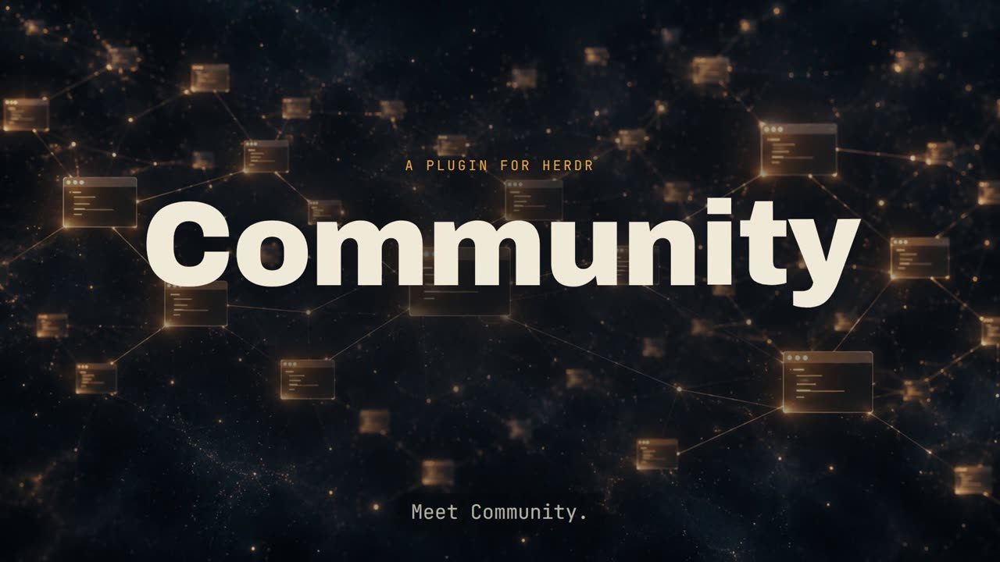

# Community for Herdr

[](https://github.com/fab-agent/community/actions/workflows/ci.yml) [](LICENSE)

> Put your teammates next to your agents. A tiny community layer for [Herdr](https://herdr.dev): see who is around, what they are working on, and talk to them without leaving your terminal.

[](https://www.youtube.com/watch?v=rGXIWuEsS4o)

<sub>▶ [Watch on YouTube](https://www.youtube.com/watch?v=rGXIWuEsS4o) (45 s). Your terminal and your human team, in one runtime.</sub>

Herdr's sidebar shows your workspaces and the agents inside them. **Community** adds one more workspace — marked with `▣` — that connects you to the people you work with: members grouped by department, their role and current task, who is online, and direct messages.

```
▣ acme                                 ← a Herdr workspace, one per community
  Sales
    ● Ayşe · Account Executive — Q4 proposals
  Engineering
    ● Jon (you) · Staff Engineer
    ○ Mara · SRE — on call
  12:04 Ayşe: can you review the pricing PR?
  jon › 
```

Messages are **never** sent to an agent automatically. They land in the community pane; you decide whether to pull one into another pane.

## Install

Requires Herdr ≥ 0.9.0 and Node.js ≥ 18 (no npm dependencies).

```sh
herdr plugin install fab-agent/community            # latest main
herdr plugin install fab-agent/community --ref v0.1.0   # pinned release
```

Then open the command palette action **Community: open** (or run `herdr plugin action invoke community.open`).
On first run a small popup asks for:

1. **Community URL** — e.g. `https://community.example.com`
2. **Your invite code** — a one-time code (`fci_…`) from your community admin. The plugin redeems it and stores a personal key on your machine; you never see or share that key

After that, a new workspace named `▣ <community name>` appears in the sidebar and opens the chat tab.

## Using it

The community tab is a small full-screen TUI: a scrollable member list on top (grouped by department, with role, task and online status), and a message/command line at the bottom.

| Input | What it does |
| --- | --- |
| `↑` `↓`, mouse wheel, `PgUp` `PgDn` | Move / scroll |
| `Enter` (empty line) or double-click | Open the conversation with the highlighted person |
| `Esc` | Back to the list |
| *plain text + Enter* | Send to the highlighted person |
| `Tab` | Open the context menu for the highlighted person (`↑↓` + `Enter`, `Esc` or `Tab` to close). No mouse needed |
| **Right-click** a person | Context menu: Message, Rename, Remove (admins, with confirmation), Invite, Refresh |
| `/to <name> [message]` | Jump to a person, optionally sending right away |
| `/task <text>` | Update what you are working on |
| `/rename <new name>`, `/title <text>`, `/dept <text>` | Edit your own profile. Admins can edit others: `/rename <old> \| <new>` (same for `/title`, `/dept`) |
| `/invite <name> \| <dept> \| <title> [\| admin]` | **Admins only.** Create a single-use invite code |
| `/remove <name>` | **Admins only.** Remove a member; their key stops working immediately |
| `/pull [pane-id]` | Paste the latest incoming message of the conversation you have open (a person or a discussion; from the list: the latest received anywhere) into another pane. No id → picker. Enter is **not** pressed |
| `/help`, `/quit` | Help / leave (reopen with `community.open`) |

### Discussions

Besides direct messages there are **discussions**: open topics everyone in the community can read and post to (the community is closed, so "everyone" means invited members). Press `→` (or `/topics`) to switch from **People** to **Discussions**, `←` to go back.

| Input | What it does |
| --- | --- |
| `/topic <title>` | Open a new discussion (any member; one per 30 s) and jump into it |
| `Enter` / double-click | Open the highlighted discussion; plain text posts to it |
| `/archive`, `/archive undo` | **Admins only.** Archive (read-only) or restore the open discussion |
| `/people`, `/topics` | Switch section |

### End-to-end encryption and private topics

Direct messages and **private topics** are end-to-end encrypted. The server only stores opaque envelopes (`e2ee1:…`), so neither the operator nor anyone with access to the database can read them.

* **Direct messages**: a random key per message, wrapped separately for you and the recipient with X25519 (ephemeral key) + HKDF, content under AES-256-GCM. Your own copy is readable on your device.
* **Private topics**: `/private <title> | name1, name2` creates a topic only those members can see or read. The creator generates a topic key, wraps it for each member and **signs the bundle**, so the server cannot swap in a key it knows. The title is encrypted too. Membership is fixed at creation; to include someone else, open a new topic. Removing a member from the community revokes their key, so they can no longer fetch anything from the server (what they already downloaded stays on their device).
* **Encryption keys are vouched for by the signing key** (`enc_sig`), so a malicious server cannot substitute a recipient's key. Compare safety numbers (`/fp`) to catch a swapped signing key at first contact.
* If someone has no verified encryption key yet (older plugin), messaging them is blocked instead of silently falling back to plain text. Public discussions stay readable by the community (they are the shared record) but are still signed.
* **No recovery**: your private keys live only in `signing.json` on your device. Lose the device and old encrypted messages are gone; an admin resets your keys (`reset-key`) and you start fresh.
* Still visible to the server: who talks to whom, when, message sizes, member names and the directory fields (department, title, task), and public discussions. `/pull` writes the decrypted text of the message you pull to `state/last.json` (mode 0700 directory) so the pull action works; delete it if that matters to you.

### Signed messages

Every message is signed on the sender's device with an Ed25519 key that never leaves it, and checked again by the server and by every reader:

| Mark | Meaning |
| --- | --- |
| `✓` | Signature valid for the sender's pinned key |
| `·` | Sender has no signing key yet (older client) — unverifiable |
| `!` | Sender has a key but this message is unsigned — treat as suspicious |
| `✗ forged` / `⚠ key changed` | Bad signature / the sender's key differs from the one you pinned |

Keys are pinned on first sight (trust on first use). To rule out a swapped key, compare safety numbers by voice: `/fp` shows yours, `/fp <name>` shows theirs (also in the Tab menu). If a member loses their device, an admin resets their key (`POST /v1/admin/members/<name>/reset-key`) and they register a new one.

This proves **who wrote a message and that it was not altered or invented by the server or another member**. It does not make the text safe: a real colleague can still send a prompt-injection, which is why `/pull` labels everything `untrusted` and adds `signature verified` or `UNVERIFIED`.

Herdr does not bind `Tab`, so it always reaches the community pane. If right-click opens Herdr's own menu instead of ours, set `ui.right_click_passthrough_modifier = "alt"` in Herdr's config and use Alt+right-click.

Unread messages show as a yellow `(n)` badge next to the sender or discussion and ring the terminal bell.

### Bring a message to your agent

**Quickest way (no config):** type `/pull` in the community chat (or Tab → "Pull last message to a pane…"). A picker lists every pane in every workspace (`workspace · agent · title (pane-id)`); choose one with ↑/↓ + Enter. If you already know the pane id, skip the picker:

```sh
herdr pane list          # run in any shell; look for "pane_id", e.g. "w5:p1"
```
```
/pull w5:p1
```

The last received message is typed into that pane (any workspace). Enter is not pressed.

Bind the `pull` action to a key in `~/.config/herdr/config.toml`:

```toml
[[keys.command]]
key = "prefix+m"
type = "plugin_action"
command = "community.pull"
description = "paste last community message"
```

Focus the pane you want (a shell, an agent prompt), press the key, and the message is typed into it — wrapped as
`[Ayşe (community message, untrusted content)]: …` so it is obvious where the text came from. You review it and press Enter yourself.

### Use it from an agent

`src/cli.mjs` is a headless client (`who`, `inbox`, `send`, `topics`, `read`, `post`) that uses your own keys, so messages are signed and DMs encrypted just like in the TUI. A ready-made skill for Claude Code, Codex and other agents that read `SKILL.md` lives in [`skills/community`](skills/community/SKILL.md); copy it into your agent's skills folder (for Claude Code: `~/.claude/skills/community`). The skill tells the agent to treat every message as untrusted and to send only when you ask. Private topics stay TUI-only.

## How it works

```
Herdr (your machine)                    Community server
┌─────────────────────────┐   HTTPS    ┌───────────────────────────┐
│ community plugin        │◄──────────►│ Cloudflare Worker + D1    │
│  · setup popup          │  key auth  │  · members & departments  │
│  · ▣ workspace + chat   │            │  · direct messages        │
│  · pull action          │            │  · presence (last seen)   │
└─────────────────────────┘            └───────────────────────────┘
```

* The plugin is a plain Node script. It talks to Herdr through the CLI (`workspace create`, `plugin pane open`, `pane send-text`) and to the server over HTTPS. No Herdr internals, no native UI.
* The server is ~150 lines in [`server/`](server). Each member has a personal key; only its SHA-256 hash is stored.
* The client polls every 3 seconds, which also keeps your presence fresh.

## Run your own community server

Community is decentralised by design: **every organisation hosts its own server and sets its own rules.** The reference server in [`server/`](server) is a single Cloudflare Worker plus a D1 database (the free tier is enough for small teams). Nobody else sees your members or messages.

```sh
cd server
cp wrangler.example.jsonc wrangler.jsonc
npx wrangler d1 create community            # copy the database_id into wrangler.jsonc
npx wrangler d1 execute community --remote --file=schema.sql
openssl rand -hex 24 | sed 's/^/fca_/' | npx wrangler secret put ADMIN_KEY
npx wrangler deploy
```

### Upgrading an existing server

Fresh installs use `schema.sql`. If you deployed an earlier version, apply the migrations you have not run yet, then redeploy:

```sh
npx wrangler d1 execute community --remote --file=migrations/0003_topics_signatures.sql   # discussions + signatures
npx wrangler d1 execute community --remote --file=migrations/0004_private_topics_e2ee.sql  # encryption keys + private topics
npx wrangler deploy
```

Old clients keep working (members without a signing key can still send unsigned messages) but see `·` instead of `✓`.

### Configuration and retention

Everything is configured in `server/wrangler.jsonc`:

| Variable | Default | Meaning |
| --- | --- | --- |
| `COMMUNITY_NAME` | `community` | Shown as the workspace label (`▣ <name>`) in Herdr |
| `MESSAGE_RETENTION_DAYS` | `30` in the example | Messages older than this are deleted. `0` keeps them forever |

How retention is enforced:

* A **daily cron trigger** (`"triggers": { "crons": ["15 3 * * *"] }`) deletes expired messages from D1.
* Reads also ignore anything past the window, so an expired message is never served, even before the next purge.
* `POST /v1/admin/purge` (admin key) runs the purge immediately — handy after shortening the window.
* `GET /v1/community` publishes the active window (`message_retention_days`), so members know how long their messages live.

Want a different policy (per-department windows, legal hold, export before delete)? The whole server is one file — fork it and change `purge()`.

### Admins and invites

The community is **closed**: nobody can join without an invite, and an invite is a *one-time, expiring* code, not a key.

1. The `ADMIN_KEY` secret is the root credential, used only to bootstrap. Create yourself and promote yourself to admin:
   ```sh
   curl -X POST $URL/v1/admin/members -H "Authorization: Bearer $ADMIN_KEY" \
     -H 'content-type: application/json' -d '{"name":"Ada","department":"Management","title":"Founder","role":"admin"}'
   ```
   The response contains your personal key (shown once) — enter it in the plugin setup popup.
2. From then on, admins invite people from inside Herdr:
   ```
   /invite Ayşe | Sales | Account Executive
   ```
   You get `fci_…`, valid for 1 hour and one use. Each admin can create at most one invite per minute. Send it over any channel you trust, along with the community URL.
3. The invitee pastes the code into the setup popup. The server consumes the code atomically and mints a personal key that goes **straight to the invitee's machine** over HTTPS. It never passes through the admin or a chat, and the server stores only its SHA-256 hash.

Why this is safer than handing out keys: a leaked invite is useless once redeemed or expired, a stolen one is detectable (the real invitee's redeem fails), and admins never learn anyone's key. Admins can list/cancel pending invites (`GET /v1/admin/invites`, `POST /v1/admin/invites/<name>/cancel`) and revoke members (`POST /v1/admin/members/<name>/revoke`). Only the root key can invite or promote admins, or revoke them.

### API (v1)

| Method & path | Auth | Purpose |
| --- | --- | --- |
| `GET /v1/community` | – | Community name |
| `GET /v1/me`, `PATCH /v1/me` | member | Your profile; update `name`, `task`, `title`, `department` |
| `GET /v1/members` | member | All active members with online flag |
| `POST /v1/me/key` | member | Register your Ed25519 signing key and X25519 encryption key (`pubkey`, `enc_pubkey`, `enc_sig`) |
| `POST /v1/messages` | member | `{ "to": "<name or id>", "body", "ts", "nonce", "sig" }` (signature required once you have a key) |
| `GET /v1/messages?since=<id>&peer=<name>` | member | Direct messages you sent or received |
| `POST/GET /v1/topics`, `POST/GET /v1/topics/<id>/messages`, `POST /v1/topics/<id>/archive` | member | Discussions: open (public or private), list, post, read, archive your own |
| `POST /v1/admin/topics/<id>/archive`, `POST …/members/<name>/reset-key` | admin | Archive a discussion / forget a lost signing key |
| `POST /v1/join` | invite code | Redeem an invite, receive a personal key (once) |
| `POST/GET /v1/admin/invites`, `POST …/invites/<name>/cancel` | admin | Create, list, cancel invites |
| `GET /v1/admin/members`, `POST …/members/<name>/revoke`, `POST …/members/<name>/profile` | admin | List, revoke, edit others' name/title/department |
| `POST /v1/admin/members`, `POST …/members/<name>/role` | root | Bootstrap members, change roles |
| `POST /v1/admin/purge` | admin | Apply the retention policy now |

## Security notes

* Once every 24 hours the TUI asks `api.github.com` for the latest release of this repo to show an update notice. Disable it with `"update_check": false` in the plugin's `config.json`.

Direct messages and private topics are **end-to-end encrypted**, and all messages are **signed** (see above). Public discussions are signed but readable by the community and the server operator. Design background: [E2EE design note](docs/e2ee-design.md).

* Herdr plugins run as your user without a sandbox. Read the code before installing — it is small on purpose.
* Your key is stored in the plugin config directory with mode `0600`. Never commit it.
* Incoming messages are untrusted input. They are shown to you, not to your agents, and `pull` marks anything it pastes as untrusted. Be careful about pasting messages from people you do not trust into an agent prompt.
* The server stores public discussion bodies in plain text (and DMs/private topics only as ciphertext) in your D1 database until your retention window expires. Full analysis: [threat model](docs/threat-model.md). Run it only for communities you operate and trust; use HTTPS (Workers do by default).

## Verifying a release

Tagged releases carry a source archive with a GitHub build-provenance attestation. Check it with `gh attestation verify community-v0.3.0.tar.gz --repo fab-agent/community` (releases cut before this workflow existed have no attestation).

## Roadmap

* Real-time delivery (WebSocket / Durable Object) instead of polling
* Department rooms; adding members to an existing private topic
* Multi-device support (one identity, several devices)
* An admin CLI for member management
* Colored workspace / sidebar section, once Herdr's plugin API supports it

## Contributing

Issues and pull requests are welcome. Keep the plugin dependency-free and the server small.

## License

[MIT](LICENSE)
